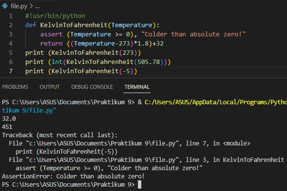
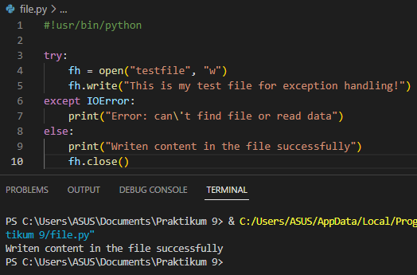
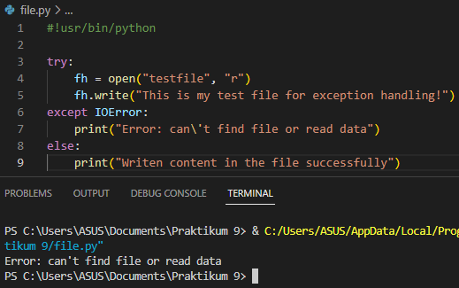
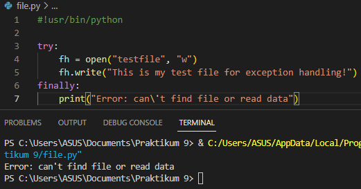
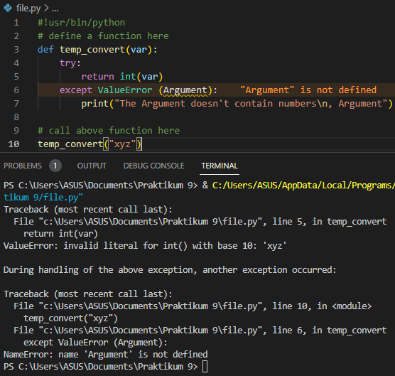
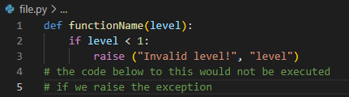

```
Muhammad Ryamizard R S
312210185
TI 22 A2
```


# Penjelasan dan Langkah-Langkah Praktikum 9 

#### Penanganan exception 
Exception merupakan sebuah kesalahan yang terjadi pada program yang sedang dijalankan, kesalahan ini akan menyebabkan program berakhir dengan tidak normal.

#### Assertion
Assertion merupakan sebuah pernyataan seperti `if`. jika benar akan melanjutkan eksekusi pada kode. dan jika salah maka akan error.

### Penjelasan 1
Berikut adalah fungsi yang mengubah suhu dari derajat kelvin menjadi derajat fahrenheit. karena 0 derajat kelvin sedingin didapat. ketika kode diatas dijalankan maka akan muncul exception yang bernama traceback.



### Penjelasan 2
ketika membuka file, menulis konten difile dan keluar dari file tidak ada masalah maka akan menghasilkan seperti berikut.



### Penjelasan 3
r adalah read untuk membuka file untuk membaca, error jika file tidak ada. jika ingin membaca file maka tambahkan 
`print(fh.readline())` dan `fh.write` dihapus.



### Penjelasan 4
karena ketika finally, try dan except dijalankan maka akan berhasil dibuat filenya.



### Penjelasan 5
ketika dijalankan akan muncul error. karena `Argument: is not defined`.



### Penjelasan 6
ketika dijalankan error artinya ada kesalahan terdapat pada sintaks. pada `raise "Invalid level!", level` ganti tanda koma dengan tanda plus. cetak def angka yang lebih besar dari 1.


